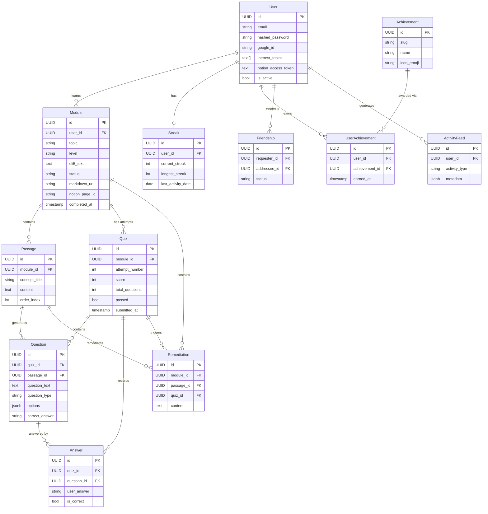
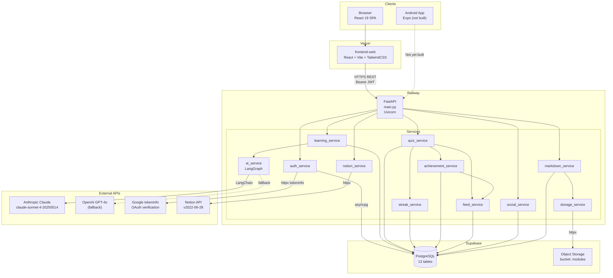
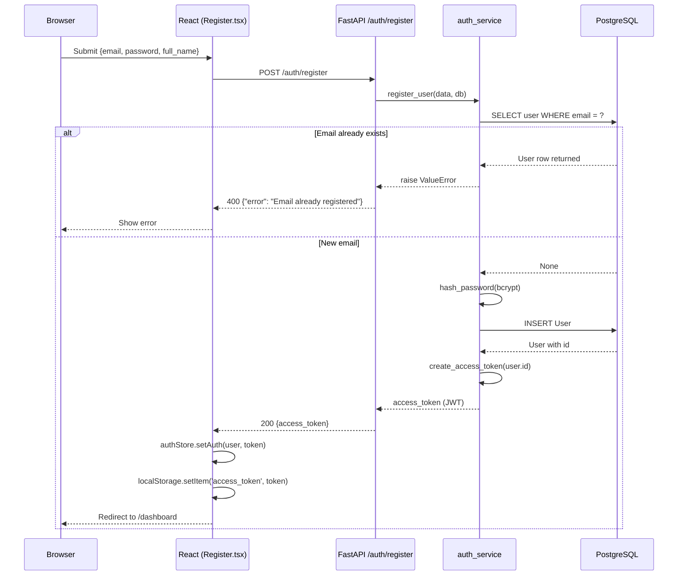
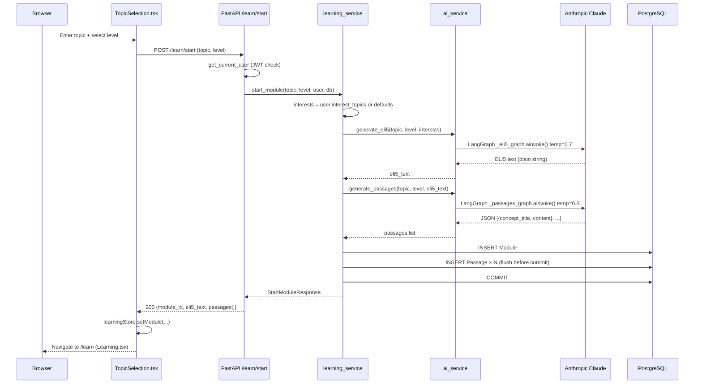
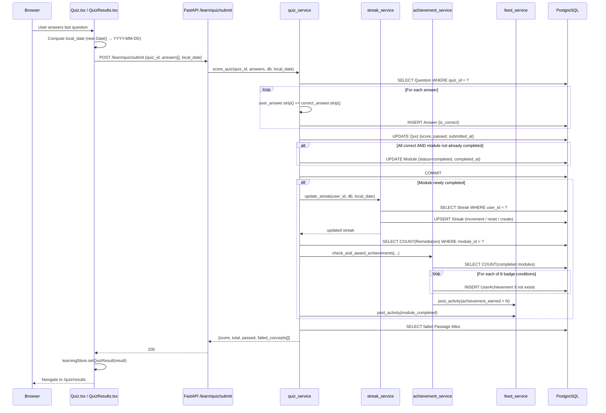
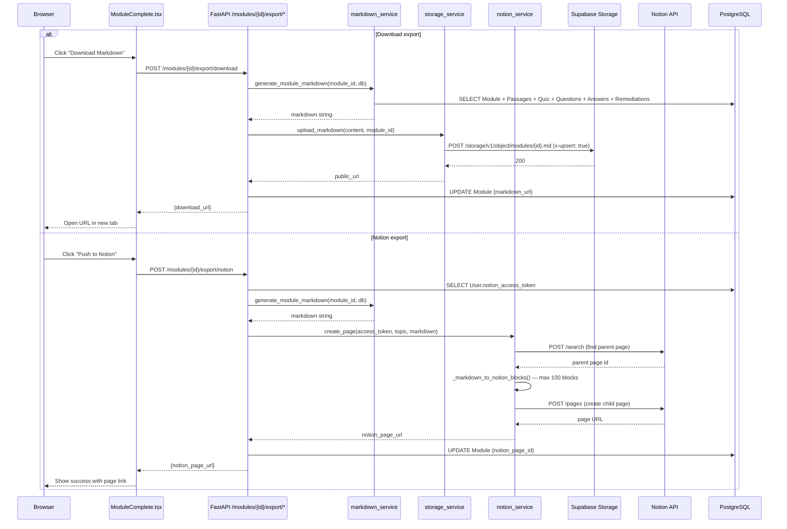
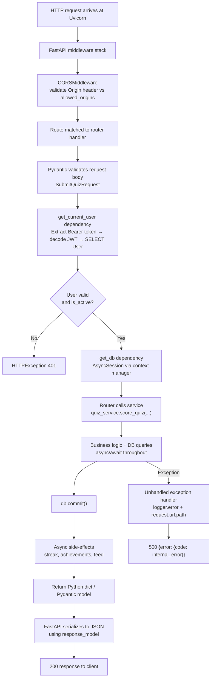

# MasterMind — System Breakdown

> **Document type:** Architecture & engineering handoff reference
> **Generated from:** Full codebase analysis — March 2026
> **Legend:** ✅ Confirmed from code | 🔷 Inferred | ❓ Not clearly defined in repository

---

## 1. Executive Summary

**MasterMind** is an adaptive AI-powered learning platform. Users select any topic and skill level, then progress through a structured learn → quiz → remediate loop until they achieve mastery. Every lesson is generated on-demand by Claude AI and personalised to the user's stated interests.

| Dimension | Detail |
|---|---|
| **Users** | Individual self-learners on web (React) or Android (Expo) |
| **Problem solved** | Traditional content is static; MasterMind generates bespoke explanations, quizzes, and re-explanations until the user actually understands |
| **Architecture** | Two-tier: React SPA + FastAPI REST API backed by PostgreSQL |
| **AI layer** | LangGraph orchestration over LangChain → Anthropic Claude (claude-sonnet-4-20250514) with OpenAI fallback |
| **Deployment** | Railway (API) + Vercel (web) + Supabase (database + file storage) |
| **Status** | Fully deployed; Android app not yet built |

---

## 2. Repository Snapshot

| Area | Path | Purpose | Notes |
|---|---|---|---|
| Backend entry | `backend/main.py` | FastAPI app, middleware, router mounting | ✅ |
| App config | `backend/app/core/config.py` | Pydantic Settings, all env vars | ✅ |
| DB engine | `backend/app/core/database.py` | Async SQLAlchemy engine + session factory | ✅ |
| Security | `backend/app/core/security.py` | bcrypt hashing, JWT create/decode | ✅ |
| LLM factory | `backend/app/core/llm.py` | Returns ChatAnthropic or ChatOpenAI | ✅ |
| Auth dependency | `backend/app/dependencies.py` | `get_current_user` FastAPI dependency | ✅ |
| ORM models | `backend/app/models/` | user, learning, gamification, social | ✅ |
| Pydantic schemas | `backend/app/schemas/` | auth, learning, gamification, social | ✅ |
| Routers | `backend/app/routers/` | auth, learning, modules, notion, gamification, social | ✅ |
| AI service | `backend/app/services/ai_service.py` | All 4 LangGraph AI functions | ✅ |
| Learning service | `backend/app/services/learning_service.py` | Module + quiz + remediation orchestration | ✅ |
| Quiz service | `backend/app/services/quiz_service.py` | Scoring, streak + achievement triggers | ✅ |
| Auth service | `backend/app/services/auth_service.py` | Register, login, Google OAuth | ✅ |
| Streak service | `backend/app/services/streak_service.py` | Timezone-aware streak calculation | ✅ |
| Achievement service | `backend/app/services/achievement_service.py` | 8-badge award engine | ✅ |
| Markdown service | `backend/app/services/markdown_service.py` | Module → `.md` compiler | ✅ |
| Storage service | `backend/app/services/storage_service.py` | Supabase Storage upload via httpx | ✅ |
| Notion service | `backend/app/services/notion_service.py` | Notion page creation via API | ✅ |
| Social service | `backend/app/services/social_service.py` | Friend graph, user search | ✅ |
| Feed service | `backend/app/services/feed_service.py` | Activity event posting + retrieval | ✅ |
| DB migrations | `backend/alembic/versions/` | 7 Alembic migrations | ✅ |
| Tests | `backend/tests/` | 51 pytest tests across 6 files | ✅ |
| Deploy config | `backend/railway.toml` | Railway RAILPACK builder + healthcheck | ✅ |
| Frontend root | `frontend-web/src/` | React 19 + TypeScript SPA | ✅ |
| Routes | `frontend-web/src/App.tsx` | BrowserRouter with 13 routes | ✅ |
| HTTP client | `frontend-web/src/api/axiosClient.ts` | Axios + JWT interceptor | ✅ |
| Global state | `frontend-web/src/store/` | Zustand: authStore + learningStore | ✅ |
| API modules | `frontend-web/src/api/` | auth, learning, modules, gamification, social | ✅ |
| Types | `frontend-web/src/types/index.ts` | 20+ TypeScript interfaces, no `any` | ✅ |
| Frontend deploy | `frontend-web/vercel.json` | Vercel SPA config | ✅ |
| Milestones | `milestones/` | 7 milestone build guides | ✅ |
| Devlog | `docs/CHECKPOINT.md` | Dated engineering log | ✅ |
| Mobile app | `frontend-mobile/` | Expo skeleton — not yet built | ❓ |

### Codebase layout

The repo is a monorepo with three independent sub-projects under one root: `backend/` (Python), `frontend-web/` (TypeScript), and `frontend-mobile/` (React Native). All three deploy independently. There is no shared build system or workspace tooling; each is self-contained with its own dependency file.

---

## 3. Functional Requirements

### Core requirements

| Priority | Requirement | Evidence from repo |
|---|---|---|
| P0 | Users can register and log in with email/password | `auth_service.register_user`, `auth_service.login_user` |
| P0 | Users can sign in with Google OAuth | `auth_service.google_login` — verifies via Google tokeninfo API |
| P0 | Users can start a learning module by entering any topic and choosing a level (kid / intermediate / expert) | `POST /learn/start` → `learning_service.start_module` |
| P0 | Users receive a personalized ELI5 explanation tied to their interests | `_eli5_node` in `ai_service.py` uses `user.interest_topics` |
| P0 | Users receive 2–3 concept passages at their chosen level | `_passages_node` generates level-specific content |
| P0 | Users take a generated 5–10 question quiz (true/false or multiple choice) | `_quiz_node` → `learning_service.generate_quiz_for_module` |
| P0 | Failed concepts trigger fresh AI re-explanations with different analogies | `_remediation_node` with explicit no-repeat instruction in prompt |
| P0 | The quiz–remediate loop repeats until all questions are answered correctly | `attempt_number` tracked; re-generation available without limit |
| P1 | Completed modules are exportable as a Markdown file | `markdown_service.generate_module_markdown` + `storage_service.upload_markdown` |
| P1 | Completed modules can be pushed to a connected Notion workspace | `notion_service.create_page` |
| P1 | Users earn streaks and achievement badges gamifying daily learning | `streak_service`, `achievement_service` |
| P1 | Users can add friends and view a shared activity feed | `social_service`, `feed_service` |
| P1 | Users can save personal interests to personalise future ELI5s | `PUT /auth/interests` |

### Secondary requirements

| Priority | Requirement | Evidence from repo |
|---|---|---|
| P2 | Users can review completed modules with their full Q&A history | `GET /modules/{id}`, `ModuleReview.tsx` page |
| P2 | Users can view their streak, longest streak, and badge collection on their profile | `GET /gamification/streak`, `GET /gamification/achievements`, `Profile.tsx` |
| P2 | Users can search for other users and manage friend requests | `GET /social/users/search`, `social_service` |
| P2 | LLM provider can be swapped from Anthropic to OpenAI with a single env var change | `llm.py` `LLM_PROVIDER` config |
| P3 | Android app mirrors web learning experience | `frontend-mobile/` directory — not yet built |

---

## 4. Non-Functional Requirements

| Requirement Type | Requirement | Why it matters | Evidence |
|---|---|---|---|
| **Latency** | AI generation calls (ELI5 + passages) complete in < 10s for most topics | `/learn/start` is synchronous — long waits would block the user | 🔷 Inferred from synchronous API design |
| **Consistency** | Quiz answers are persisted before side-effects (streak, achievements) fire | Prevents lost answers if side-effect fails | ✅ `db.commit()` in `quiz_service.py:84` before streak/achievement calls |
| **Reliability** | Backend restarts automatically on process failure | Single-instance Railway deploy | ✅ `restartPolicyType = "on_failure"` in `railway.toml` |
| **Security** | All user-generated content requests require a valid JWT | Prevents data leakage between users | ✅ `get_current_user` dependency on all protected routes |
| **Security** | Passwords stored as bcrypt hashes, never in plaintext | OWASP requirement | ✅ `security.py` — `pwd_context.hash()` |
| **Security** | Secrets never committed to git | Prevents credential leakage | ✅ `.env` in `.gitignore`, `.env.example` committed |
| **Security** | CORS restricted to configured frontend origins | Prevents unauthorized cross-origin requests | ✅ `allowed_origins` from `FRONTEND_URL` env var |
| **Maintainability** | No logic in routers; all business logic in services | Testability and separation of concerns | ✅ Routers contain only HTTP glue |
| **Maintainability** | All I/O validated by Pydantic schemas | Prevents raw ORM objects leaking to API consumers | ✅ Enforced across all routers |
| **Observability** | Unhandled exceptions logged with request path and traceback | Debug visibility in production | ✅ `unhandled_exception_handler` in `main.py` |
| **Availability** | Health endpoint for Railway monitoring | Enables automatic restart on failure | ✅ `GET /health` → `{"status": "ok"}` |
| **Scale** | 🔷 No horizontal scale configuration; assumed single Railway instance | Solo developer, early-stage traffic | ❓ No load balancer, no connection pool config beyond asyncpg |
| **Timezone** | Streaks use client-supplied local date, not server UTC | Prevents streak loss for users in non-UTC timezones | ✅ `local_date` parameter in `streak_service.update_streak` |

---

## 5. Core Entities / Domain Model

| Entity | Description | Key Fields | Stored In | Evidence |
|---|---|---|---|---|
| **User** | Registered learner | `id` (UUID PK), `email` (UQ), `hashed_password` (nullable), `google_id` (UQ, nullable), `interest_topics` (TEXT[]), `notion_access_token`, `is_active` | PostgreSQL `users` | `models/user.py` |
| **Module** | One learning session on one topic | `id`, `user_id` (FK), `topic`, `level`, `eli5_text`, `status` (in_progress/completed), `markdown_url`, `notion_page_id`, `completed_at` | PostgreSQL `modules` | `models/learning.py` |
| **Passage** | One concept block within a module | `id`, `module_id` (FK), `concept_title`, `content`, `order_index` | PostgreSQL `passages` | `models/learning.py` |
| **Quiz** | One attempt at the module's questions | `id`, `module_id` (FK), `attempt_number`, `score`, `total_questions`, `passed`, `submitted_at` | PostgreSQL `quizzes` | `models/learning.py` |
| **Question** | One question in a quiz | `id`, `quiz_id` (FK), `passage_id` (FK), `question_text`, `question_type` (true_false/multiple_choice), `options` (JSONB), `correct_answer`, `order_index` | PostgreSQL `questions` | `models/learning.py` |
| **Answer** | User's answer to one question | `id`, `quiz_id` (FK), `question_id` (FK), `user_answer`, `is_correct` | PostgreSQL `answers` | `models/learning.py` |
| **Remediation** | Fresh AI re-explanation for a failed concept | `id`, `module_id` (FK), `passage_id` (FK), `quiz_id` (FK), `content` | PostgreSQL `remediations` | `models/learning.py` |
| **Streak** | User's learning streak record | `id`, `user_id` (FK, UQ), `current_streak`, `longest_streak`, `last_activity_date` | PostgreSQL `streaks` | `models/gamification.py` |
| **Achievement** | Seeded badge definition | `id`, `slug` (UQ), `name`, `description`, `icon_emoji` | PostgreSQL `achievements` | `models/gamification.py` |
| **UserAchievement** | Badge earned by a user | `id`, `user_id` (FK), `achievement_id` (FK), `earned_at` — UNIQUE(user_id, achievement_id) | PostgreSQL `user_achievements` | `models/gamification.py` |
| **Friendship** | Directed friend relationship | `id`, `requester_id` (FK), `addressee_id` (FK), `status` (pending/accepted/rejected) | PostgreSQL `friendships` | `models/social.py` |
| **ActivityFeed** | Event log for social feed | `id`, `user_id` (FK), `activity_type` (module_completed/achievement_earned), `metadata` (JSONB) | PostgreSQL `activity_feed` | `models/social.py` |

### Entity Relationship Diagram



---

## 6. High-Level Architecture



### Building blocks

| Block | Technology | Role |
|---|---|---|
| **Web client** | React 19 + TypeScript + Vite | SPA served from Vercel; JWT stored in `localStorage` |
| **API gateway** | FastAPI + Uvicorn on Railway | Single process; no proxy layer in front |
| **Business logic** | Python service layer (11 services) | Pure async functions; no logic in routers |
| **AI orchestration** | LangGraph + LangChain | 4 compiled StateGraphs; one per AI operation |
| **LLM** | Anthropic Claude (primary) / OpenAI (fallback) | Provider switched via `LLM_PROVIDER` env var |
| **Database** | PostgreSQL via asyncpg + SQLAlchemy 2.0 | 13 tables; all PKs UUID |
| **Object storage** | Supabase Storage | Markdown exports; public `modules` bucket |
| **Auth** | JWT (python-jose) + bcrypt + Google tokeninfo | Stateless; no server-side session |
| **File exports** | Supabase Storage + Notion API | Two independent export channels |

---

## 7. Main Services / Modules

| Service / Module | Responsibility | Key Files | Depends On |
|---|---|---|---|
| **ai_service** | All LLM calls; 4 compiled LangGraph graphs | `services/ai_service.py`, `core/llm.py` | LangChain, Anthropic/OpenAI API |
| **learning_service** | Orchestrates module start, quiz generation, remediation | `services/learning_service.py` | ai_service, DB models |
| **quiz_service** | Scores submissions, triggers side-effects atomically | `services/quiz_service.py` | streak_service, achievement_service, feed_service |
| **auth_service** | Register, login, Google OAuth, interests save | `services/auth_service.py` | security.py, Google tokeninfo API |
| **streak_service** | Timezone-aware streak calculation | `services/streak_service.py` | Streak model |
| **achievement_service** | Checks 8 badge conditions, awards idempotently | `services/achievement_service.py` | Achievement model, feed_service |
| **feed_service** | Writes and reads activity events | `services/feed_service.py` | ActivityFeed model |
| **social_service** | Bidirectional friend graph, user search | `services/social_service.py` | User, Friendship, Streak models |
| **markdown_service** | Assembles completed module into Markdown | `services/markdown_service.py` | All learning models |
| **storage_service** | Uploads Markdown to Supabase Storage via httpx | `services/storage_service.py` | Supabase Storage API |
| **notion_service** | Creates Notion pages from Markdown via Notion API | `services/notion_service.py` | Notion API, User.notion_access_token |

### Service detail: ai_service

**Responsibility:** All Claude/OpenAI calls. Exposes 4 public async functions. Each function builds and invokes a minimal single-node LangGraph.

**Architecture:** `LearningState` TypedDict flows through the graph. Each graph has `START → node → END`. Graphs are compiled once at module import time (not per-request).

```
generate_eli5()       → _eli5_graph       → temp 0.7, max 400 tokens  → str
generate_passages()   → _passages_graph   → temp 0.5, max 1500 tokens → list[dict]
generate_quiz()       → _quiz_graph       → temp 0.4, max 2000 tokens → list[dict]
generate_remediation()→ _remediation_graph→ temp 0.7, max 1500 tokens → list[dict]
```

**Business rules enforced in prompts:**
- ELI5 must use one of the user's listed interests as the analogy vehicle
- ELI5 must not start with "imagine"
- Passages must not repeat the ELI5
- Quiz `correct_answer` must exactly match one of the `options` strings
- Remediation must use completely different analogies from the original passages

**Failure points:** LLM returns malformed JSON → `json.loads()` raises exception, bubbles as 500. No retry logic is implemented. ❓

### Service detail: quiz_service.score_quiz

**Responsibility:** Score answers, persist results, conditionally trigger streak + achievement + feed in a single call.

**Ordering (confirmed from code):**
1. Load all `Question` rows for the quiz
2. Compare each `user_answer` (exact string match, stripped) to `correct_answer`
3. Write `Answer` rows + update `Quiz.score`, `Quiz.passed`, `Quiz.submitted_at`
4. If all passed and module not already completed → set `module.status = "completed"`
5. `db.commit()` (atomic boundary)
6. **After commit:** call `streak_service`, `achievement_service`, `feed_service`
7. Return `{score, total, passed, failed_concepts}`

**Critical note:** Side-effects (streak, achievements, feed) run **after** the main commit. If they fail, the quiz is still marked passed but the side-effects are lost. There is no retry or transaction rollback covering both. ✅/❓

---

## 8. API / Interface Breakdown

Base URL: `https://mastermindai-production.up.railway.app`
Auth: `Authorization: Bearer <jwt>` on all protected routes.
Response shape: `{"data": {...}}` on success | `{"error": {"code": "...", "message": "..."}}` on error.

### Authentication

| Method | Path | Auth | Input | Output | Handler |
|---|---|---|---|---|---|
| POST | `/auth/register` | No | `{email, password, full_name}` | `{access_token}` | `routers/auth.py` → `auth_service.register_user` |
| POST | `/auth/login` | No | `{email, password}` | `{access_token}` | `routers/auth.py` → `auth_service.login_user` |
| POST | `/auth/google` | No | `{id_token}` | `{access_token}` | `routers/auth.py` → `auth_service.google_login` |
| GET | `/auth/me` | Yes | — | User object | `routers/auth.py` → `get_current_user` dep |
| PUT | `/auth/interests` | Yes | `{interest_topics: [str]}` | Updated User | `routers/auth.py` — inline update |

### Learning

| Method | Path | Auth | Input | Output | Handler |
|---|---|---|---|---|---|
| POST | `/learn/start` | Yes | `{topic, level}` | `{module_id, eli5_text, passages[]}` | `routers/learning.py` → `learning_service.start_module` |
| POST | `/learn/quiz/generate` | Yes | `{module_id}` | `{quiz_id, questions[]}` | `routers/learning.py` → `learning_service.generate_quiz_for_module` |
| POST | `/learn/quiz/submit` | Yes | `{quiz_id, answers[], local_date?}` | `{score, total, passed, failed_concepts[]}` | `routers/learning.py` → `quiz_service.score_quiz` |
| POST | `/learn/remediate` | Yes | `{module_id, quiz_id, failed_concepts[]}` | `{remediations[]}` | `routers/learning.py` → `learning_service.remediate` |

### Modules

| Method | Path | Auth | Input | Output | Handler |
|---|---|---|---|---|---|
| GET | `/modules` | Yes | — | Module list | `routers/modules.py` |
| GET | `/modules/{id}` | Yes | — | Full module with passages | `routers/modules.py` |
| POST | `/modules/{id}/export/download` | Yes | — | `{download_url}` | `routers/modules.py` → `markdown_service` + `storage_service` |
| POST | `/modules/{id}/export/notion` | Yes | — | `{notion_page_url}` | `routers/modules.py` → `notion_service` |

### Gamification

| Method | Path | Auth | Output | Handler |
|---|---|---|---|---|
| GET | `/gamification/streak` | Yes | `{current_streak, longest_streak, last_activity_date}` | `routers/gamification.py` → `streak_service.get_streak` |
| GET | `/gamification/achievements` | Yes | Achievement list | `routers/gamification.py` → `achievement_service.get_user_achievements` |

### Social

| Method | Path | Auth | Input | Output | Handler |
|---|---|---|---|---|---|
| GET | `/social/friends` | Yes | — | Friend list with streaks | `routers/social.py` → `social_service.get_friends` |
| GET | `/social/friends/requests` | Yes | — | Incoming pending requests | `routers/social.py` |
| POST | `/social/friends/request` | Yes | `{addressee_id}` | `{message}` | `routers/social.py` → `social_service.send_friend_request` |
| POST | `/social/friends/accept` | Yes | `{friendship_id}` | `{message}` | `routers/social.py` → `social_service.accept_friend_request` |
| GET | `/social/feed` | Yes | — | 50 most recent events (user + friends) | `routers/social.py` → `feed_service.get_feed` |
| GET | `/social/users/search?q=` | Yes | `q` query param | User list (max 20) | `routers/social.py` → `social_service.search_users` |

### Notion OAuth

| Method | Path | Auth | Output | Handler |
|---|---|---|---|---|
| GET | `/notion/auth-url` | Yes | `{url}` | `routers/notion.py` |
| GET | `/notion/callback` | No | Redirect to frontend | `routers/notion.py` |
| DELETE | `/notion/disconnect` | Yes | `{message}` | `routers/notion.py` |

### Health

| Method | Path | Auth | Output |
|---|---|---|---|
| GET | `/health` | No | `{"status": "ok"}` |

---

## 9. End-to-End User Flows

### Flow 1: User Registration

**Goal:** Create an account and receive a JWT
**Trigger:** User submits registration form at `/register`



**Data written:** `users` row
**Failure path:** Duplicate email → 400. DB failure → 500 (unhandled exception handler logs + returns generic error).

---

### Flow 2: Starting a Learning Module

**Goal:** Generate and store a personalised ELI5 + concept passages
**Trigger:** User submits topic + level at `/learn/start`



**Data written:** `modules` row, `passages` rows (2–3)
**Failure path:** LLM returns invalid JSON → `json.loads()` raises → 500. User with no interests gets fallback `["general knowledge", "science", "history"]`.

---

### Flow 3: Quiz Submission (with Side-Effects)

**Goal:** Score a quiz; if all correct, complete the module and award streak/badges
**Trigger:** User submits answers from `Quiz.tsx`



**Data written:** `answers`, `quizzes` (updated), optionally `modules` (updated), `streaks` (updated), `user_achievements`, `activity_feed`
**Failure path:** If side-effect calls throw after the main commit, the module remains completed but streak/badges/feed may be inconsistent. No compensating transaction.

---

### Flow 4: Remediation Loop

**Goal:** Re-explain failed concepts with fresh analogies; allow quiz retry
**Trigger:** User clicks "Start Remediation" on `QuizResults.tsx`

```mermaid
sequenceDiagram
    participant Browser
    participant React as Remediation.tsx
    participant API as FastAPI /learn/remediate
    participant LearnSvc as learning_service
    participant AISvc as ai_service
    participant LLM as Anthropic Claude
    participant DB as PostgreSQL

    Browser->>React: Click "Start Remediation"
    React->>API: POST /learn/remediate {module_id, quiz_id, failed_concepts[]}
    API->>LearnSvc: remediate(module_id, quiz_id, failed_concepts, db)
    LearnSvc->>DB: SELECT Module, SELECT Passage WHERE module_id = ?
    LearnSvc->>AISvc: generate_remediation(topic, failed_concepts, original_passages)
    AISvc->>LLM: _remediation_graph.ainvoke() temp=0.7
    LLM-->>AISvc: [{concept_title, content}, ...] — fresh analogies
    AISvc-->>LearnSvc: remediations list
    loop For each remediation
        LearnSvc->>DB: INSERT Remediation
    end
    LearnSvc->>DB: COMMIT
    LearnSvc-->>API: RemediateResponse
    API-->>React: 200 {remediations[]}
    React->>React: learningStore.setRemediations(...)
    React-->>Browser: Show re-explanations
    Browser->>React: Click "Retake Quiz"
    React->>API: POST /learn/quiz/generate {module_id}
    Note over React,API: New quiz attempt generated; attempt_number incremented
```

**Data written:** `remediations` rows
**Loop:** User can repeat remediation → retake → submit indefinitely. `attempt_number` tracks total attempts.

---

### Flow 5: Module Export (Markdown / Notion)

**Goal:** Export completed module to a file download or Notion page
**Trigger:** User clicks export button on `ModuleComplete.tsx`



---

## 10. Request / Response Lifecycle

A typical authenticated request (e.g. `POST /learn/quiz/submit`) follows this path:



**Key implementation details (confirmed):**
- `AsyncSessionLocal` uses `expire_on_commit=False` — objects remain usable after commit
- `statement_cache_size=0` set on asyncpg engine — required for pgbouncer compatibility
- No request-level logging middleware beyond the unhandled exception handler
- No rate limiting middleware present ❓
- No request ID / trace ID propagation ❓

---

## 11. Data Storage and State Management

| Store | Technology | Purpose | Data Examples | Accessed By |
|---|---|---|---|---|
| **Primary DB** | PostgreSQL (Supabase) via asyncpg | All application data | users, modules, quizzes, streaks | All backend services via SQLAlchemy |
| **Object Storage** | Supabase Storage (public bucket `modules`) | Markdown export files | `{module_id}.md` | `storage_service.py` via httpx |
| **Frontend state** | Zustand `authStore` | JWT + user object, persists in memory | `{user, token}` | All authenticated pages |
| **Frontend state** | Zustand `learningStore` | Multi-page learning flow state | `{moduleId, quizId, questions, quizResult, remediations}` | TopicSelection → Learning → Quiz → QuizResults → Remediation → ModuleComplete |
| **Auth token** | `localStorage` (key: `access_token`) | JWT persistence across page refreshes | JWT string | `axiosClient.ts` interceptor reads on every request |
| **Cache** | None | — | — | ❓ No Redis or in-memory cache implemented |
| **Queues** | None | — | — | ❓ No queue system; all processing is synchronous |

### Frontend state flow

```
TopicSelection → setModule(moduleId, topic, level, eli5Text, passages)
               → navigate to /learn

Learning       → reads eli5Text, passages from learningStore
               → navigate to /quiz

Quiz           → generates quiz (sets quizId, questions)
               → submits answers → setQuizResult(result)
               → navigate to /quiz/results

QuizResults    → reads quizResult.passed
               → if passed → navigate to /complete
               → if failed → POST remediate → setRemediations
                          → navigate to /remediation

Remediation    → reads remediations
               → "Retake Quiz" → re-POST quiz/generate → navigate to /quiz

ModuleComplete → clearStore via reset() after export
```

---

## 12. Background Jobs, Events, and Async Processing

**No background job system is implemented.** ✅ confirmed — no Celery, no APScheduler, no Redis, no task queues.

All processing is **synchronous within the HTTP request lifecycle:**

| Operation | When | How |
|---|---|---|
| Streak update | During `POST /learn/quiz/submit` | Called inline in `quiz_service.score_quiz` after DB commit |
| Achievement check | During `POST /learn/quiz/submit` | Called inline after streak update |
| Activity feed post | During `POST /learn/quiz/submit` and achievement award | Called inline from `quiz_service` and `achievement_service` |
| Markdown generation | During `POST /modules/{id}/export/download` | Synchronous DB assembly + httpx upload |
| Notion page creation | During `POST /modules/{id}/export/notion` | Synchronous httpx calls to Notion API |
| LLM calls | During `/learn/start`, `/learn/quiz/generate`, `/learn/remediate` | Awaited async LangGraph invocations within the HTTP request |

**Implication:** Long LLM calls (up to ~10s) block the HTTP response. If Railway's request timeout is hit, the client gets a 502 but the DB write may have partially completed. ❓ No timeout or cancellation handling on LLM calls.

---

## 13. Authentication and Authorization

### Method
JWT-based stateless authentication using `python-jose` (HS256).

### Token lifecycle
1. Client authenticates via `POST /auth/login` or `POST /auth/google` → receives `access_token`
2. Token stored in browser `localStorage`
3. `axiosClient.ts` reads token from `localStorage` and adds `Authorization: Bearer <token>` to every request
4. Backend `get_current_user` dependency (`dependencies.py`) decodes token, looks up user in DB, checks `is_active`
5. Token expires after `ACCESS_TOKEN_EXPIRE_MINUTES` (default: 60 min)

### Google OAuth flow
- Frontend uses `@react-oauth/google` to obtain a Google `id_token`
- Frontend sends `id_token` to `POST /auth/google`
- Backend calls `https://oauth2.googleapis.com/tokeninfo?id_token=<token>` via httpx
- If valid, extracts `sub`, `email`, `name`, `picture`
- Upserts User row (matches by `google_id` first, then by `email`)
- Returns own JWT

### Middleware / guards

| Layer | Implementation | File |
|---|---|---|
| Backend auth guard | `get_current_user` FastAPI dependency | `app/dependencies.py` |
| Frontend route guard | `ProtectedRoute` React component | `src/components/ProtectedRoute.tsx` |
| Token injection | Axios request interceptor | `src/api/axiosClient.ts` |

### Authorization model
- **No role-based access control.** All authenticated users have identical permissions.
- **Resource ownership enforced at service layer:** e.g. quiz can only be submitted if the quiz belongs to the authenticated user's module (inferred from FK chain, not explicit ownership check). ❓ Explicit user_id ownership checks are not consistently present in all service functions.

### Protected routes (frontend)
All routes except `/`, `/login`, `/register` are wrapped in `ProtectedRoute` which redirects to `/login` if no token in Zustand `authStore`.

---

## 14. External Integrations

| External Service | Purpose | Where Used | Failure Impact |
|---|---|---|---|
| **Anthropic Claude** (`claude-sonnet-4-20250514`) | Primary LLM for all AI content generation | `ai_service.py` via LangChain `ChatAnthropic` | All `/learn/*` endpoints fail; no fallback logic in code (fallback is config-only) |
| **OpenAI GPT-4o** | Optional LLM fallback | `core/llm.py` — activated via `LLM_PROVIDER=openai` | Not used unless explicitly configured |
| **Google tokeninfo API** (`oauth2.googleapis.com`) | Verify Google ID tokens for OAuth login | `auth_service.google_login` | `POST /auth/google` returns 401; email/password login unaffected |
| **Supabase PostgreSQL** | Primary data store | All services via SQLAlchemy + asyncpg | Complete backend failure; all endpoints down |
| **Supabase Storage** | Store generated Markdown files | `storage_service.py` via httpx | `POST /modules/{id}/export/download` fails; Notion export unaffected |
| **Notion API** (`api.notion.com`) | Create learning summary pages | `notion_service.py` via httpx | `POST /modules/{id}/export/notion` fails; file download unaffected |
| **Railway** | Backend hosting and auto-deploy | `railway.toml`, `Procfile` | Full backend outage |
| **Vercel** | Frontend hosting and auto-deploy | `vercel.json` | Frontend inaccessible; API unaffected |

---

## 15. Deployment and Runtime Architecture

### Local development

```bash
# Backend
cd backend
uv venv && source .venv/bin/activate
uv pip install -r requirements.txt
cp .env.example .env  # fill in secrets
alembic upgrade head
uvicorn main:app --reload --port 8000

# Frontend
cd frontend-web
npm install
cp .env.example .env  # set VITE_API_BASE_URL
npm run dev
```

### Backend — Railway

| Config key | Value | Source |
|---|---|---|
| Builder | RAILPACK | `railway.toml` |
| Build command | `pip install -r requirements.txt` | `railway.toml` |
| Start command | `uvicorn main:app --host 0.0.0.0 --port $PORT` | `railway.toml` |
| Healthcheck path | `/health` | `railway.toml` |
| Healthcheck timeout | 30s | `railway.toml` |
| Restart policy | On failure | `railway.toml` |
| Live URL | `https://mastermindai-production.up.railway.app` | `docs/CHECKPOINT.md` |

**Process model:** Single Uvicorn process. No Gunicorn worker manager. No horizontal scaling configured. ✅

### Frontend — Vercel

| Config | Value | Source |
|---|---|---|
| Root directory | `frontend-web` | `vercel.json` |
| Framework | Vite | Auto-detected |
| Build command | `npm run build` | Inferred |
| Output directory | `dist` | Vite default |
| SPA routing | All routes → `index.html` | `vercel.json` (inferred) |

### Database — Supabase

- Hosted PostgreSQL managed by Supabase
- Connection via `DATABASE_URL=postgresql+asyncpg://...`
- `statement_cache_size=0` on engine (pgbouncer compatibility)
- Schema managed by Alembic; 7 migration files

### Configuration strategy
All secrets and environment-specific values via `.env` (local) or platform environment variables (Railway/Vercel). Loaded by `pydantic_settings.BaseSettings` on backend; `import.meta.env.VITE_*` on frontend.

### CI/CD
No CI/CD pipeline file found (no `.github/workflows/`, no `Dockerfile`). ❓
**Inferred:** Deploys trigger on `git push origin main` via Railway and Vercel's GitHub integrations.

---

## 16. Observability and Reliability

| Area | Implementation | Evidence |
|---|---|---|
| **Error logging** | `logging.getLogger(__name__)` + unhandled exception handler logs path + exception | `main.py:9`, `main.py:21-27` |
| **Structured logging** | Not implemented — plain Python `logging` module | ❓ No JSON log format configured |
| **Distributed tracing** | Not implemented | ❓ No trace IDs, no OpenTelemetry |
| **Metrics** | Not implemented | ❓ No Prometheus, no StatsD |
| **Health check** | `GET /health → {"status": "ok"}` | `main.py:38-40` |
| **DB health check** | Not included in health endpoint — only returns OK | ❓ No DB ping |
| **Retries** | Not implemented for LLM calls or external API calls | ❓ httpx calls have no retry logic |
| **Timeouts** | Not explicitly set on LLM or httpx calls | ❓ |
| **Restart on failure** | Railway `restartPolicyType = "on_failure"` | `railway.toml` |
| **Idempotency** | Achievement awards are idempotent via DB UNIQUE constraint | `achievement_service.py:21-28` |
| **Upsert on export** | Supabase Storage upload uses `x-upsert: true` | `storage_service.py:20` |

---

## 17. Security Considerations

| Concern | Implementation | Evidence | Gap |
|---|---|---|---|
| **Password storage** | bcrypt via passlib; plain password never stored | `security.py` | — |
| **JWT signing** | HS256 with `SECRET_KEY` (≥ 32 chars enforced by env) | `security.py` | No key rotation mechanism |
| **Token expiry** | 60 minutes default (`ACCESS_TOKEN_EXPIRE_MINUTES`) | `config.py` | No refresh token — expired sessions require re-login |
| **CORS** | `allowed_origins` derived from `FRONTEND_URL` env var; comma-separated for multi-origin support | `config.py:26`, `main.py:13-19` | — |
| **Secrets** | `.env` in `.gitignore`; `.env.example` committed with placeholders | `.gitignore`, `.env.example` | — |
| **Input validation** | Pydantic v2 on all request bodies | All routers | — |
| **SQL injection** | Parameterised queries via SQLAlchemy ORM; no raw SQL | Confirmed — no `text()` calls found | — |
| **XSS** | React's JSX escaping + no `dangerouslySetInnerHTML` usage | 🔷 Inferred from standard React | Not audited |
| **Authorization** | JWT dependency on all protected routes; `is_active` check | `dependencies.py` | Resource-level ownership not always explicitly validated in service layer |
| **Rate limiting** | Not implemented | ❓ | API is open to abuse; no throttling on LLM-triggering endpoints |
| **Notion token storage** | Stored in plaintext in `users.notion_access_token` DB column | `models/user.py` | Not encrypted at rest beyond Supabase default |
| **Google token verification** | Google's own tokeninfo endpoint (no local library) | `auth_service.py:41-46` | Adds a synchronous network hop; tokeninfo endpoint is rate-limited by Google |

---

## 18. Bottlenecks / Risks / Technical Debt

| Risk | Why it matters | Evidence | Suggested improvement |
|---|---|---|---|
| **Synchronous LLM calls block HTTP threads** | `POST /learn/start` makes 2 sequential LLM calls (ELI5 then passages) inside the HTTP request. Under load, this saturates the single Uvicorn worker. | `learning_service.py:34-35` | Move to background task (FastAPI `BackgroundTasks` or Celery); poll for completion |
| **No retry on LLM or external API calls** | A transient Anthropic API error returns a 500 to the user with no recovery | `ai_service.py` — no try/except around LLM calls | Add tenacity retry with exponential backoff |
| **Side-effects outside main transaction** | Streak, achievements, and feed post after `db.commit()`. If they fail, quiz is marked passed but gamification is lost | `quiz_service.py:87-114` | Wrap in a single transaction or use an outbox pattern |
| **No rate limiting** | LLM calls are expensive; a single user could trigger hundreds of generations | No middleware | Add per-user rate limiting (e.g. slowapi) on `/learn/*` endpoints |
| **JWT with no refresh token** | 60-minute expiry with no refresh flow — users get logged out mid-session | `config.py:10`, `axiosClient.ts` | Implement refresh token rotation |
| **Notion 100-block limit** | `notion_service.py` slices to `blocks[:100]` — long modules silently truncated | `notion_service.py:59` | Append additional blocks in subsequent API calls |
| **No ownership validation on quiz submit** | Service doesn't verify that `quiz_id` belongs to the authenticated user's module | `quiz_service.py` | Add `WHERE module.user_id = current_user.id` join |
| **`statement_cache_size=0`** | Disables asyncpg's prepared statement cache — reduces throughput under load | `database.py:8` | Evaluate whether pgbouncer is actually in use; if not, remove this workaround |
| **No DB connection pool config** | Default asyncpg pool settings; no `pool_size`, `max_overflow`, or `pool_timeout` | `database.py` | Set explicit pool parameters for production load |
| **Notion uses internal token (not OAuth)** | Code comment in `notion_service.py` describes a migration path to OAuth that hasn't been implemented; the router has OAuth endpoints but the service is internal-token-only | `notion_service.py:1-8` | Complete OAuth flow or document internal token requirement clearly |
| **No observability stack** | Errors only visible in Railway logs; no alerting, no dashboards | `main.py` | Add Sentry for error tracking; structured JSON logging |
| **Android app not built** | `frontend-mobile/` exists but is empty | Directory structure | Milestone 8 work |
| **LLM JSON parsing without schema validation** | `json.loads(response.content.strip())` — if LLM returns non-JSON, raw exception propagates | `ai_service.py:112, 165, 211` | Validate parsed structure with Pydantic before returning |

---

## 19. Suggested Improvements

### Quick wins (1–3 days each)

| Improvement | Rationale |
|---|---|
| Add Sentry error tracking | Zero-config `sentry-sdk[fastapi]` gives full error context, request data, and alerting |
| Add `slowapi` rate limiting on `/learn/*` | Prevents LLM cost abuse; 5 requests/minute per user is reasonable |
| Add resource ownership check in `quiz_service` | Prevents user A submitting answers for user B's quiz |
| Validate LLM JSON output with Pydantic | Wrap `json.loads()` in a try/except; validate shape before returning to router |
| Extend `/health` to ping the DB | `SELECT 1` via asyncpg gives a real liveness signal |

### Medium-term fixes (1–2 weeks each)

| Improvement | Rationale |
|---|---|
| Implement refresh token rotation | Eliminates 60-minute re-login friction; store refresh token in httpOnly cookie |
| Move LLM calls to background tasks | Return `module_id` immediately; poll `GET /modules/{id}` for `status=ready`; eliminates 10s blocking |
| Add tenacity retry on LLM + external API calls | 3 retries with exponential backoff on transient failures |
| Wrap streak + achievement + feed in a single transaction | Use a Postgres advisory lock or outbox pattern to ensure gamification consistency |
| Paginate `GET /social/feed` | Currently hardcoded to 50; add `limit`/`offset` or cursor pagination |
| Complete Notion OAuth flow | The router has OAuth endpoints; `notion_service.py` has a comment explaining the migration path |

### Long-term scalability (1+ months)

| Improvement | Rationale |
|---|---|
| Add a task queue (Celery + Redis or ARQ) | Decouple LLM generation from HTTP; enables retries, dead-letter queues, progress streaming |
| Structured JSON logging + log aggregation | Enables log search, dashboards, and alerting at scale |
| Connection pooling (PgBouncer or pgbouncer-mode in Supabase) | Required for multi-instance backend deployments |
| Horizontal scaling on Railway | Multi-instance behind a load balancer; requires removing `statement_cache_size=0` workaround |
| Knowledge map / learning graph | Visual representation of topics mastered; mentioned in `CLAUDE.md` page list as `KnowledgeMap` |
| Push notifications for streaks | Daily reminder via Expo Notifications (mobile app dependency) |

---

## 20. Open Questions / Unknowns

| Question | Why it matters |
|---|---|
| What is the exact Vercel deployment URL? | Not present in any code file; referenced as TBD in `CHECKPOINT.md` |
| Is pgbouncer actually in front of Supabase? | `statement_cache_size=0` suggests yes, but no evidence of explicit pgbouncer config |
| What are the 8 achievement slugs and their human-readable names? | `achievement_service.py` references `first_steps`, `knowledge_seeker`, `scholar`, `clean_sweep`, `comeback_kid`, `streak_starter`, `hot_streak`, `dedicated` — but the seed data script is not in the repo |
| What is the seed_achievements script? | Referenced in dev setup notes but not present in `backend/` |
| Is there a CI pipeline? | No `.github/workflows/` or equivalent found |
| What is the Notion OAuth redirect URI in production? | `NOTION_REDIRECT_URI` defaults to `http://localhost:8000/notion/callback`; production value unknown |
| Is the Notion integration internal token or OAuth in production? | `notion_service.py` comment says it's internal; OAuth router endpoints exist but the service doesn't implement them |
| How are `correct_answer` strings normalised? | Only `.strip()` is applied. Case sensitivity could cause false failures if LLM returns different casing across requests |
| What happens to the LangGraph state if an LLM call times out? | No timeout is configured; Uvicorn default or httpx default applies |
| Is `frontend-mobile/` completely empty or partially scaffolded? | Directory exists but contents were not verified |

---

## 21. Final "How This App Works" Summary

A user opens MasterMind in their browser (React SPA on Vercel) and registers an account. Their password is bcrypt-hashed before storage; a signed JWT is returned and stored in `localStorage`. Every subsequent API call includes this token in an `Authorization: Bearer` header, which the FastAPI backend validates by decoding the JWT and loading the live `User` row from PostgreSQL.

The user picks a topic — say "Black holes" at intermediate level — and hits **Start Learning**. The frontend posts to `POST /learn/start`. FastAPI delegates to `learning_service.start_module`, which reads the user's interest topics from the DB (e.g. `["football", "cooking"]`), then makes two sequential async LangGraph invocations against Claude: first an ELI5 using the user's interests as the analogy vehicle, then 2–3 concept passages at the chosen level. Both the `Module` and its `Passage` rows are committed to PostgreSQL, and the full response returns to the browser, which stores everything in Zustand's `learningStore` and navigates to the Learning page.

After reading, the user takes a quiz. `POST /learn/quiz/generate` calls Claude again — this time to produce 5–10 true/false or multiple-choice questions from the passage content. Questions are stored in the DB (without answers exposed to the client). The user answers all questions in the browser, and `POST /learn/quiz/submit` fires with their answers and their local date. The backend scores each answer by exact string comparison, commits all `Answer` rows and updates the `Quiz` record. If every answer is correct and the module wasn't already complete, the `Module.status` flips to `completed` — then, in the same request (after the main commit), the streak is updated using the client-supplied date (avoiding UTC-vs-local timezone bugs), achievements are checked against 8 conditions and awarded idempotently, and activity feed events are written.

If the user failed any concepts, the frontend calls `POST /learn/remediate` with the list of failed concept titles. Claude generates fresh re-explanations using entirely different analogies, which are stored as `Remediation` rows and displayed. The user can then generate another quiz (`attempt_number` increments) and retry indefinitely.

On module completion, the user can export a Markdown summary: `markdown_service` assembles the full ELI5 + passages + quiz Q&A + remediations from the DB into a `.md` string, which `storage_service` uploads to Supabase Storage via a raw httpx POST with `x-upsert: true`. The public URL is returned and saved on the `Module` row. Alternatively, if the user has connected their Notion workspace, `notion_service` finds the first accessible parent page via the Notion search API, converts the Markdown to Notion block objects (max 100), and creates a child page — returning the page URL.

Throughout the flow, the entire state of an in-progress module (module ID, quiz ID, questions, results, remediations) lives in the browser's Zustand store. It is not persisted across browser sessions — reloading mid-quiz sends the user back to the dashboard, where their modules are listed by status and can be reviewed via `GET /modules/{id}`.
